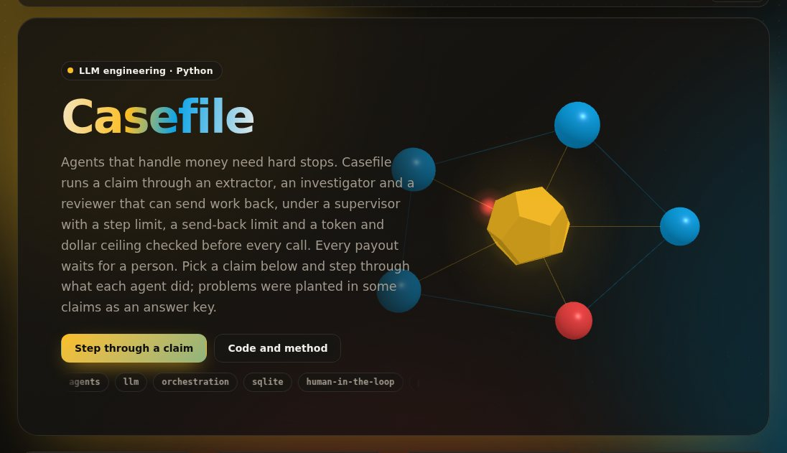

# casefile

[](https://umer-78.github.io/casefile/)

**Live demo:** https://umer-78.github.io/casefile/ (step through 30 recorded claim runs, agent by agent, up to the human gate)

Claims triage for an auto insurer. A supervisor coordinates three specialist agents:

- an **extractor** that reads the claim packet;
- an **investigator** that checks cover, limits, prior claims and pricing;
- a **reviewer** that sends work back when it can't be trusted yet.

The system is bounded, observable and replayable:

- **Typed handoffs.** Every message between nodes is a validated dataclass; no free text travels.
- **Stored state.** The whole claim state is written to SQLite after every step, so any run resumes from any snapshot.
- **Hard stops.** Each claim has a token ceiling, a dollar ceiling, a step limit and a send-back limit, all enforced in code before each call.
- **A human gate.** A payout recommendation waits for a person, and only `approve()` writes a payout back.

The agents here are deterministic, so every run replays exactly. Each node call is metered as if a model had made it: instructions plus input, and output capped at the node's `max_tokens`. An LLM agent drops in behind the same contract (`casefile/llm.py`); it is not measured here, since the repository runs without API keys. Real claim files are private, so the claims are synthetic. Each packet (first notice of loss, policy, repair estimate) is generated from a seed, and the problems an adjuster looks for are planted in known claims.

## Results

`python -m casefile bench` runs 900 claims, a day's volume, in under a second.

**The ship gates:**

- **30 recorded runs.** Each run's node path is in `results/bench.md` and its full state in `results/runs.jsonl`.
- **Replay from a snapshot.** CLM-0000 was resumed from its step-3 snapshot and reached the same terminal state: path, recommendation and cost fingerprint all match.
- **The reviewer sends work back and the graph still stops.** 290 of 900 claims were sent back at least once (232 once, 58 twice):
  - to the extractor, when a garage's estimate lines don't add up to its stated total;
  - to the investigator, when the prior-claims lookup timed out.

  Every claim stopped, the longest after 9 node runs (limit 10). 12 claims hit the send-back limit and stopped for a human rather than looping.
- **Cost ceiling enforced by code.** The median claim cost $0.00037 and the most expensive $0.00084, against a $0.002 ceiling. With the ceiling cut to $0.0006, 218 claims stopped before the call that would have crossed it, and none spent more than $0.00056. Each node's maximum output is reserved before it runs, so the ceiling can't be crossed.
- **The human gate.** 518 payouts waited for approval and none paid without one.

**Cost per claim (900 claims):**

```
$0.00034-0.00040 ################################################## 579
$0.00040-0.00046 ###                                                31
$0.00046-0.00052 ######                                             69
$0.00052-0.00059 #####                                              56
$0.00059-0.00065 #####                                              61
$0.00065-0.00071 ######                                             74
$0.00071-0.00077 #                                                  8
$0.00077-0.00084 ##                                                 22
```

The first bar is claims that went straight through; the rest were sent back once or twice.

**Planted problems caught (900 claims):**

| Problem | Planted | Caught | False flags on other claims |
|---|---|---|---|
| over the policy limit | 98 | 87 (89%) | 0 |
| lapsed policy | 105 | 105 (100%) | 0 |
| inflated estimate | 107 | 95 (89%) | 0 |
| duplicate of a prior claim | 127 | 125 (98%) | 0 |
| missing estimate | 105 | 105 (100%) | 0 |

- The over-limit and inflated-estimate misses are all claims that also had no estimate, so there was nothing to check the price against. Those are referred for an estimate instead.
- The two duplicate misses are claims whose prior-claims lookup failed three times; they stopped for a human.

These numbers show the agents check what they should on data built to test them. They are not accuracy on real claims.

## How it works

```python
from casefile.claims import make
from casefile.graph import Limits, Store, run, approve

store = Store("claims.db")
state = run(make(1), store, Limits(max_steps=10, max_dollars=0.002))
state["path"], state["status"], state["recommendation"], state["cost"]
state = run(make(1), store, state=store.load("CLM-0001", 2))   # resume from any snapshot
approve(store, "CLM-0001", "adjuster-7")                        # the only way a payout is written back
```

- `casefile/messages.py`: the typed handoffs (`Extracted`, `Findings`, `Review`, `Recommendation`).
- `casefile/agents.py`: the specialists and a claims-history tool that times out now and then (seeded, so replays match).
- `casefile/graph.py`: the supervisor state machine, the stop conditions, the metering, the store and the approval gate.
- `casefile/claims.py`: the claim generator and its answer key.

```bash
pip install -e '.[dev]'
pytest -q
python -m casefile bench
python -m casefile.demo    # rebuild the live demo's data in docs/
```
